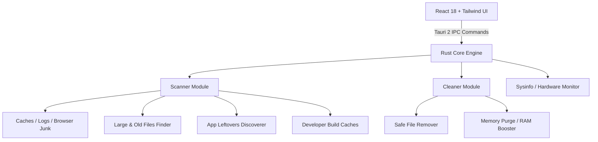

# myOSCleaner 🚀
> **The Modern, Ultra-Fast, Open-Source CleanMyMac & Universal PC Cleaner for macOS, Linux, and Windows.**  
> Built with **Rust**, **Tauri 2**, **React**, and **Tailwind CSS**.

[](LICENSE.md)
[](https://www.rust-lang.org/)
[](https://tauri.app/)
[](https://reactjs.org/)
[](https://tailwindcss.com/)

---

## 🌟 Overview

**myOSCleaner** is a blazing-fast, lightweight, and completely open-source cross-platform desktop system cleaner and space manager designed with simplicity and visual elegance in mind. Inspired by CleanMyMac, it delivers a 1-click **Smart Scan** experience along with deep granular cleaning modules designed to be intuitive and beginner-friendly ("dumb-proof" UX) while offering extreme speed and safety powered by Rust.

---

## ✨ Key Features

### 🔮 1. Smart Scan (One-Click Wonder)
- **Central Glowing Interactive Orb**: Intuitive one-click button that scans the entire system in parallel.
- **Dynamic Live Counter**: Real-time visualization of gigabytes found across all categories.
- **Celebration Confetti**: Rewarding visual completion animations when your machine is cleaned.

### 🧹 2. System Junk & Cache Cleaner
- **System & User Caches**: `~/Library/Caches`, `/Library/Caches`, `~/.cache`, and temp directories.
- **Application & Service Logs**: Cleans accumulated historical logs and background execution traces.
- **Browser Caches**: Google Chrome, Safari, Firefox, Edge, Brave, Arc, and Opera offline assets.
- **Crash & Diagnostic Dumps**: Removes accumulated crash logs and OS diagnostic reports.

### 🗑️ 3. Trash Bins Manager
- **Primary & External Trashes**: Deep scan of `~/.Trash` and connected external volume trash bins.
- **Itemized Inspection**: Preview files, view deletion dates, inspect sizes, or reveal in Finder before emptying.
- **Safe Empty**: 1-click permanent wipe with confirmation guard.

### 📦 4. Large & Old Files Explorer
- **Multi-Category Filtering**: Archives (`.zip`, `.tar`, `.7z`), Disk Images (`.dmg`, `.iso`), Videos (`.mp4`, `.mov`), Documents, and Installers.
- **Size Filters**: `> 1 GB`, `500 MB - 1 GB`, `100 MB - 500 MB`.
- **Age Filters**: Older than 1 year, 6 months, or 1 month.
- **Finder Integration**: 1-Click "Reveal in Finder / Explorer" for instant location verification.

### 🧩 5. App Uninstaller & Leftovers Cleaner
- **Complete Application Scan**: Detects installed applications across `/Applications` and `~/Applications`.
- **Footprint Breakdown**: Computes exact storage taken by Binary, Application Support data, Caches, and Preferences.
- **Complete Uninstall**: Eliminates both the app bundle and all associated scattered leftovers.
- **App Reset**: Reclaims gigabytes of cached data while keeping the application installed.

### 💻 6. Developer Workspace Optimizer (Pro Saver)
- **Automatic Build Artifact Detection**: Scans user project directories for heavy intermediate build folders:
  - `node_modules` & `dist` (Node.js / Web)
  - `target/` (Rust Cargo)
  - `.gradle/` & `build/` (Gradle / Android / Java)
  - `.venv/` & `__pycache__` (Python)
  - Xcode `DerivedData` & Archives
- **1-Click Purge Inactive Projects**: Instantly selects and cleans projects untouched for `> 30 days`.

### ⚡ 7. RAM & Memory Booster
- **Real-Time Memory Gauge**: Visual donut meter showing Active, Inactive/Cached, and Free RAM.
- **1-Click Purge RAM**: Discards inactive memory cache pages and triggers memory compaction.
- **Live Hardware Monitor**: CPU load, core count, Swap file usage, and system uptime.

### 🛡️ 8. Bulletproof Safety ("Dumb-Proof" UX)
- **Protected Root Whitelist**: Critical system folders (`/`, `/System`, `/Library`, `/usr`, `/bin`, user document roots) are strictly protected by Rust safety rules.
- **Safety Levels**: Color-coded badges (`Safe`, `Review Recommended`, `Caution`).

---

## 🛠️ Architecture & Tech Stack



- **Frontend**: React 18, TypeScript, Tailwind CSS, Lucide Icons, Canvas Confetti.
- **Desktop Runtime**: [Tauri 2](https://tauri.app/) (Lightweight, memory-efficient, native webview).
- **Backend Core**: Rust (High concurrency file scanning, `walkdir`, `sysinfo`, `rayon`).

---

## 🚀 Quick Start & Development

### Prerequisites
1. **Rust & Cargo**: [Install Rust](https://www.rust-lang.org/tools/install) (`curl --proto '=https' --tlsv1.2 -sSf https://sh.rustup.rs | sh`)
2. **Node.js / Bun / PNPM**: Node 18+ or Bun

### 1. Clone & Install
```bash
git clone https://github.com/uchitchakma/myMacCleaner.git
cd myMacCleaner

# Install frontend dependencies
bun install
# or: pnpm install / npm install
```

### 2. Run in Development Mode
```bash
# Start frontend and Tauri window
bun run tauri dev
# or: pnpm tauri dev
```

### 3. Build Production Bundle
```bash
bun run tauri build
# or: pnpm tauri build
```
The compiled standalone executable / installer (`.dmg`, `.app`, `.deb`, `.exe`) will be generated in `src-tauri/target/release/bundle/`.

---

## 🔒 Security & Privacy

- **100% Offline & Private**: Zero telemetry, zero cloud tracking, zero network requests for local scanning.
- **Open Source**: Full transparency—every single line of cleaning code is inspectable.

---

## 📄 License

This project is licensed under the [MIT License](LICENSE.md) — feel free to use, modify, and distribute.

Developed with ❤️ by **[Uchit Chakma](https://uchitchakma.com)** & **[UCDREAMS TECHNOLOGIES LLP](https://ucdreams.com)**.
