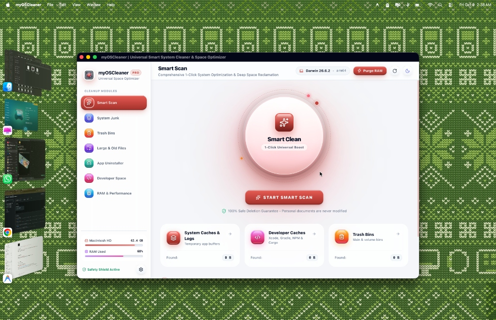
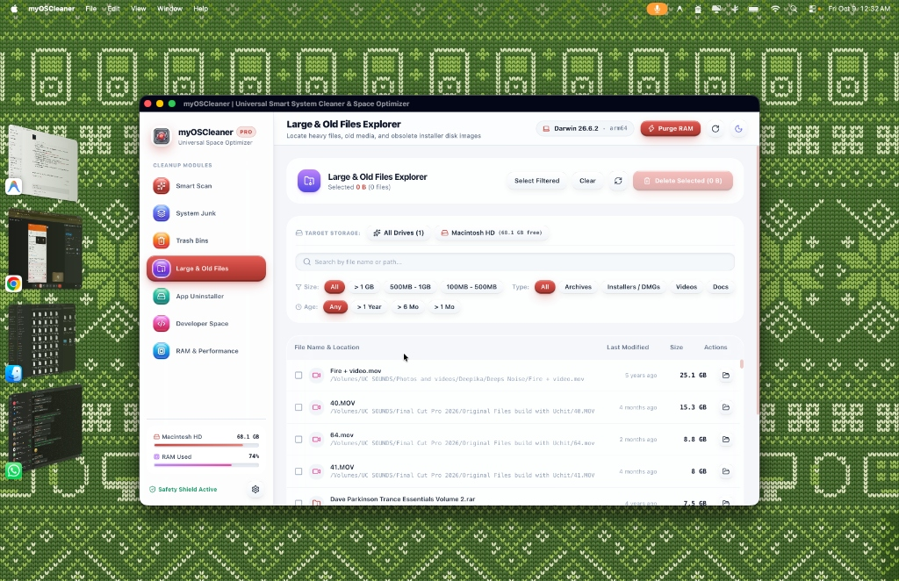
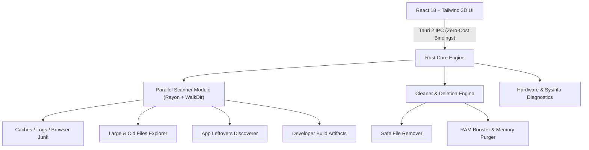

<div align="center">

  

  # myOSCleaner 🚀
  
  **The Ultra-Fast, 3D Glassmorphic Open-Source System Cleaner & Space Optimizer**  
  *Native macOS, Windows & Linux Desktop Application built with Rust & Tauri 2*

  [](https://github.com/uchitchakma/myOSCleaner/releases/latest)

  <br />

  [](LICENSE)
  [](https://www.rust-lang.org/)
  [](https://tauri.app/)
  [](https://reactjs.org/)
  [](https://tailwindcss.com/)
  [](#-multi-platform-downloads)

</div>

---

## 📸 Interface Preview

<div align="center">

### 🔮 1-Click Smart Clean & Real-Time Storage Diagnostics


<br /><br />

### 📦 Large & Old Files Explorer with Multi-Drive Filtering


</div>

---

## 🌟 What is myOSCleaner?

**myOSCleaner** is a blazing-fast, featherweight (~6 MB), and completely open-source cross-platform system cleaner and space manager. Inspired by CleanMyMac and crafted with **VisionOS-grade 3D Glassmorphism**, it delivers a 1-click **Smart Scan** experience along with granular cleanup modules designed to be effortless, intuitive, and beginner-friendly ("dumb-proof" UX) while offering extreme speed and safety powered by Rust.

---

## 📦 Multi-Platform Downloads

Download the latest version directly from [**GitHub Releases**](https://github.com/uchitchakma/myOSCleaner/releases/latest):

| Platform | Format | Description |
| :--- | :--- | :--- |
| 🍏 **macOS** | [`.dmg`](https://github.com/uchitchakma/myOSCleaner/releases/latest) | Universal Installer (Apple Silicon M1/M2/M3/M4 & Intel) |
| 🪟 **Windows** | [`.exe` / `.msi`](https://github.com/uchitchakma/myOSCleaner/releases/latest) | 64-bit Windows 10 & 11 Setup |
| 🐧 **Linux** | [`.deb` / `.AppImage`](https://github.com/uchitchakma/myOSCleaner/releases/latest) | Debian / Ubuntu Package & Standalone AppImage |

---

## ⚡ Performance Comparison

Unlike traditional cleaners built with Electron that bundle entire web browser runtimes, **myOSCleaner** compiles down to a native Rust binary:

| Feature / Metric | myOSCleaner *(Tauri v2 + Rust)* | CleanMyMac X | Typical Electron Cleaners |
| :--- | :--- | :--- | :--- |
| **Download / Bundle Size** | **~6.0 MB** ⚡ | ~160 MB | ~200 MB – 350 MB |
| **Native Binary Size** | **5.0 MB** | Proprietary | ~120 MB |
| **Idle Memory (RAM)** | **~25 MB – 35 MB** | ~140 MB | ~300 MB – 600 MB |
| **Titlebar Style** | **Seamless Frameless Overlay** | Seamless Window | Solid Standard Bar |
| **Open Source & Private** | **100% Free & Open Source** | Paid Subscription | Varies |

---

## ✨ Key Features

### 🔮 1. Smart Scan (One-Click Clean)
- **Interactive 3D Glass Button**: 1-click comprehensive scan across system caches, trash bins, and developer space in parallel.
- **Dynamic Real-Time Counter**: Live visualization of reclaimed gigabytes with celebration animations.
- **Multi-Volume Detection**: Live storage capacity meters for internal NVMe SSDs and external drives.

### 🧹 2. System & Application Junk Cleaner
- **System & User Caches**: `~/Library/Caches`, `/Library/Caches`, `~/.cache`, and temp buffers.
- **Browser Caches**: Chrome, Safari, Firefox, Edge, Brave, Arc, and Opera offline assets.
- **Service & Diagnostic Logs**: Cleans historical background logs and crash dumps.

### 🗑️ 3. Multi-Volume Trash Bins Manager
- **Primary & External Trashes**: Deep scan of `~/.Trash` and all connected external drive `.Trashes` volumes.
- **Itemized Inspection**: Preview files, creation dates, sizes, or reveal in Finder before emptying.

### 📦 4. Large & Old Files Explorer
- **Multi-Category Filtering**: Archives (`.zip`, `.rar`, `.7z`), Disk Images (`.dmg`, `.iso`), Videos (`.mp4`, `.mov`), Documents, and Installers.
- **Drive Switcher**: Target specific internal partitions or external USB SSD/HDD drives.
- **Size & Age Filters**: Filter by `> 1 GB`, `500 MB - 1 GB`, or age older than 1 year, 6 months, or 1 month.

### 🧩 5. App Uninstaller & Leftover Cleaner
- **Complete Footprint Breakdown**: Inspect exact storage taken by Binary, App Support data, Caches, and Preferences.
- **Complete Uninstall**: Eliminates the app bundle and all scattered hidden leftovers.
- **1-Click Reset**: Restores applications to default state by wiping caches without reinstalling.

### 💻 6. Developer Workspace Optimizer
- **Reclaims Heavy Build Caches**:
  - `node_modules` & `dist` (Node.js / Web)
  - `target/` (Rust Cargo)
  - `.gradle/` & `build/` (Gradle / Android / Java)
  - `.venv/` & `__pycache__` (Python)
  - Xcode `DerivedData` & Archives
- **1-Click Inactive Project Purge**: Automatically detects projects untouched for `> 30 days`.

### ⚡ 7. RAM & Memory Booster
- **Real-Time Memory Gauge**: Visual donut gauge showing Active, Inactive/Cached, and Free unified RAM.
- **1-Click Purge RAM**: Discards inactive memory pages and compacts system memory.
- **Hardware Monitor**: Live CPU load, core count, Swap file usage, and system uptime.

### 🛡️ 8. Bulletproof Safety
- **System Protected Whitelist**: Critical system folders (`/`, `/System`, `/Library`, `/usr`, `/bin`, user personal documents) are strictly protected by Rust safety rules.
- **Safety Levels**: Color-coded safety tags (`Safe`, `Review Recommended`, `Caution`).

---

## 🛠️ Architecture & Tech Stack



---

## 🚀 Quick Start & Local Development

### Prerequisites
1. **Rust & Cargo**: [Install Rust](https://www.rust-lang.org/tools/install) (`curl --proto '=https' --tlsv1.2 -sSf https://sh.rustup.rs | sh`)
2. **Node.js or Bun**: Node 18+ or Bun

### 1. Clone & Install
```bash
git clone https://github.com/uchitchakma/myOSCleaner.git
cd myOSCleaner

# Install dependencies
bun install
# or: npm install
```

### 2. Run in Development Mode
```bash
bun run tauri dev
# or: npm run tauri dev
```

### 3. Build Production Installers
```bash
bun run tauri build
# or: npm run tauri build
```
The compiled standalone executable and installer (`.dmg`, `.app`, `.deb`, `.exe`) will be generated in `src-tauri/target/release/bundle/`.

---

## 🔒 Security & Privacy

- **100% Offline & Private**: Zero telemetry, zero cloud tracking, zero network requests for local scanning.
- **Open Source**: Full transparency—every single line of cleaning code is inspectable.

---

## 📄 License & Credits

This project is licensed under the [MIT License](LICENSE) — feel free to use, modify, and distribute.

Developed with ❤️ by **[Uchit Chakma](https://uchitchakma.com)** & **[UCDREAMS TECHNOLOGIES LLP](https://ucdreams.com)**.
